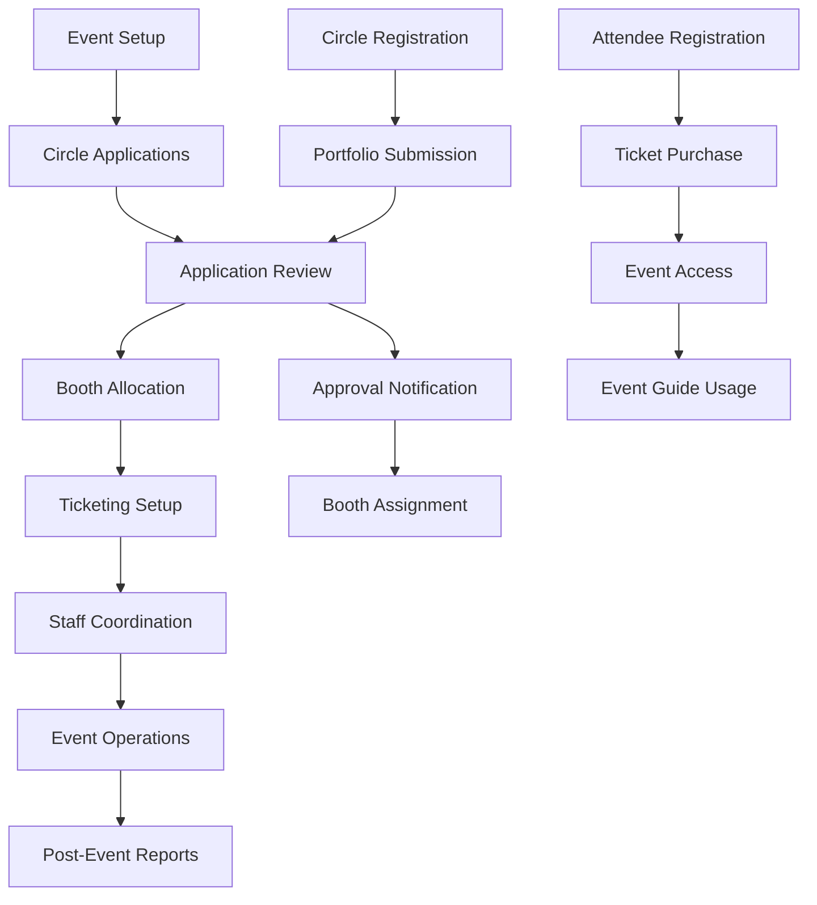

# DoujinDesk - Product Requirements Document

## Table of Contents

1. [Product Overview](#1-product-overview)
2. [Core Features](#2-core-features)
3. [Core Process](#3-core-process)
4. [Catalogue Output Specifications](#4-catalogue-output-specifications)
5. [User Interface Design](#5-user-interface-design)
6. [Performance Requirements](#6-performance-requirements)
7. [Security & Compliance](#7-security--compliance)
8. [Implementation Guidelines](#8-implementation-guidelines)
9. [Testing & Quality Assurance](#9-testing--quality-assurance)
10. [Deployment & Maintenance](#10-deployment--maintenance)
11. [Stakeholder Guidelines](#11-stakeholder-guidelines)
12. [Troubleshooting & FAQ](#12-troubleshooting--faq)

***

## 1. Product Overview

### 1.1 Executive Summary

DoujinDesk is a Progressive Web Application (PWA) designed to manage the complete lifecycle of doujin/comic conventions, from circle applications to post-event archiving. The platform enables event organizers to efficiently handle thousands of vendor applications, booth allocations, ticketing, and real-time operations even in venues with unreliable internet connectivity.

### 1.2 Problem Statement

The platform addresses the critical need for offline-first convention management, supporting events ranging from small local gatherings to massive conventions like Comiket with 35,000+ creator booths and 750,000+ attendees.

### 1.3 Target Market

* **Primary**: Comic convention organizers (100-35,000 booths)

* **Secondary**: Artist alley coordinators, fan convention managers

* **Geographic**: Global, with initial focus on Asia-Pacific region

### 1.4 Success Metrics

* Handle 10,000+ circle applications with 99.9% uptime

* Reduce application processing time by 70%

* Support 100+ concurrent staff users

* Achieve sub-second search response times

* Maintain 50MB+ offline data capacity

## 2. Core Features

### 2.1 User Roles

| Role                  | Registration Method        | Core Permissions                                             |
| --------------------- | -------------------------- | ------------------------------------------------------------ |
| Event Admin           | Direct system setup        | Full system access, event configuration, financial oversight |
| Staff Manager         | Admin invitation           | Circle management, booth allocation, staff coordination      |
| Staff Member          | Manager invitation         | Assigned module access, data entry, attendee assistance      |
| Volunteer             | Staff invitation           | Limited access to assigned tasks, basic data viewing         |
| Circle Representative | Public registration portal | Application submission, booth management, communication      |
| Attendee              | Public registration        | Event guide access, ticket management, notifications         |

### 2.2 Feature Modules

Our DoujinDesk platform consists of the following main modules:

1. **Dashboard**: Real-time event statistics, quick actions, notification center
2. **Circle Management**: Application processing, directory management, approval workflows
3. **Booth Allocation**: Interactive floor planning, assignment management, capacity optimization
4. **Ticketing System**: Multi-tier pricing, QR/RFID generation, access control
5. **Financial Management**: Payment processing, multi-currency support, revenue analytics
6. **Staff Coordination**: Role management, task assignment, communication tools
7. **Event Guide**: Public-facing attendee interface with interactive maps and catalogs

### 2.3 Circle Application Form Specifications

#### Registration Type Selection

**Price List (IDR)**

| Space   | Single Day | Both Days  |
| ------- | ---------- | ---------- |
| 1 Space | IDR 465K   | IDR 835K   |
| 2 Space | IDR 930K   | IDR 1,670K |
| 4 Space | IDR 1,860K | IDR 3,340K |
| Booth A | -          | IDR 2,325K |
| Booth B | -          | IDR 4,650K |

**PayPal Rates (USD)**

| Space   | Single Day | Both Days |
| ------- | ---------- | --------- |
| 1 Space | USD 43     | USD 78    |
| 2 Space | USD 86     | USD 156   |
| 4 Space | USD 172    | USD 312   |
| Booth A | -          | USD 200   |
| Booth B | -          | USD 400   |

***

### Circle Space

1 Circle Space = table 90cm x 45cm + 2 chairs
**No electricity provided**

**Circle Space Rules:**

* Maximum 4 Spaces per circle

* Additional bookings are counted as separate circles and are not guaranteed to be placed adjacent

***

### Circle Booth

**Booth A** (2m x 2m, 2 days):

* 1 table 100×50×75cm

* 2 chairs

* 1 exclusive electricity (2 amp)

**Booth B** (4m x 2m, 2 days):

* 2 tables 100×50×75cm

* 4 chairs

* 1 exclusive electricity (2 amp)

**Circle Booth Rules:**

1. Custom booths are not allowed. If you want a custom booth, register for Corporate Booth category
2. Maximum 1 booth (A or B) per circle. Additional bookings are counted as separate circles

***

### Additional Items for Circle Booth

**Price List:**

* Additional table (100×50×75cm): IDR 250K (USD 22)

* Additional chair: IDR 100K (USD 8)

***

### Exhibitor Pass

* 1 Circle Space = 3 Passes

* Booth A = 4 Passes

* Booth B = 8 Passes

* All passes provide early access before public opening

**Additional passes:**

* Maximum 2 additional passes

* IDR 100K (USD 9) per day (SAT/SUN)

* IDR 200K (USD 18) for Both Days (Circle Space/Booth)

* Can only be ordered during registration

#### Form Field Categories

**Basic Circle Information**

* Circle Name (required, short-answer, max 100 chars)

* Your Name (required, short-answer, max 50 chars)

* Pen Name (optional, short-answer, max 50 chars)

* Circle Member Type (required, dropdown: Individual/Group Circle)

* Member Names (conditional, short-answer, max 200 chars, shown if Group Circle)

* Email Address (required, email validation)

**Registration Type & Booth Preferences**

* Registration Type (required, radio: Circle Booth, Circle Space)

* Space Selection (conditional):

  * If Circle Booth: Automatically assigned booth space

  * If Circle Space: Dropdown (1/2/4 space)

* Event Days (conditional):

  * If Circle Booth: Automatically both days (Saturday & Sunday)

  * If Circle Space: Dropdown (Saturday Only, Sunday Only, Both Days)

* Request Extra Items (conditional, dropdown: Yes/No, circle booth only)

* Extra Table (conditional dropdown: 0/1/2, shown if circle booth and extra items = Yes)

* Extra Chair (conditional dropdown: 0/1/2, shown if circle booth and extra items = Yes)

* Additional Exhibitor Passes (dropdown: 0, 1, 2, 3, 4, 5)

**Work & Content Details**

* Circle Works (required, multiple choice: Comic Book, Artbook, Magazine, Photobook (Cosplay), Photobook (General), Novel, Game (Digital), Game (Analog), Audio Music, Audio ASMR, Handmade Crafts, Live Commission, Goods/Merchandise)

  * Note: These selections automatically populate catalog boolean fields (SellsComic, SellsArtbook, etc.)

* Goods Variety (conditional, multiple choice: Acrylic Standee, Clothing, Key Holders, Pins/Badges, Posters, Stickers, Other)

* Goods Variety Other (conditional text field, enabled when "Other" selected)

* Genre (required, dropdown: Original, Fanart/Parody)

* Fandom (short-answer, always visible for both Original and Fanart/Parody)

  * Disclaimer: "Fandom will determine your circle space area."

* Other Fandoms (optional, long-answer, max 500 chars)

* Target Demography (required, radio: Male Oriented, Female Oriented)

* Rating (required, dropdown: PG, M, GA)

* Expected Queue (dropdown: Yes, No - inquires about potential long queues in the morning)

**File Uploads**

* Sample Works (required, image upload, max 256KB, JPG/PNG only)

* Circle Cut (required, image upload, max 256KB, JPG/PNG only, square format preferred)

**Social Media & Contact**

* X/Twitter (optional, URL validation) → Maps to `circle_twitter`

* Instagram (optional, URL validation) → Maps to `circle_instagram`

* Facebook Page (optional, URL validation) → Maps to `circle_facebook`

* Website/Marketplace Link (optional, URL validation) → Maps to `marketplace_link`

* Other Social Media (optional, URL validation) → Maps to `circle_other_socials`

* Phone Number (required, phone format validation)

* City (required, short-answer)

* Discord ID (optional, short-answer)

**Circle Cut & Catalog Information**

### CIRCLE CUT & CATALOG

**Circle Cut Instructions:**

1. Download template V1/V2 (right-click save as)
2. Fill using image editing software or scan template
3. Recommended to use latest illustration from works that will be sold at the event
4. Upload completed result to form

* Circle Cut Upload (required, image upload, max 256KB, JPG/PNG, square format)

  * Used for: Event catalog, promotional materials, booth identification

  * Specifications: 400x400px minimum, square aspect ratio preferred

  * Will be displayed in: Digital catalog, printed program, mobile app

* Catalog Description (optional, text area, max 200 chars)

  * Brief description of your circle for catalog listing

  * Will appear alongside your circle cut in attendee guides

**Event History & Agreement**

* First Time Participant (required, dropdown: Yes/No)

* Terms Agreement (required, checkbox: "I have read and agree to the Terms of Service")

* Catalog Consent (required, checkbox: "I consent to my circle information being included in the event catalog and promotional materials")

#### Parameter Inheritance & Mapping Rules

**Circle Works to Catalog Mapping:**

* Comic Book → `SellsComic` = true

* Artbook → `SellsArtbook` = true

* Magazine → `SellsMagazine` = true

* Photobook (Cosplay) → `SellsPhotobookCosplay` = true

* Photobook (General) → `SellsPhotobookGeneral` = true

* Novel → `SellsNovel` = true

* Game (Digital/Analog) → `SellsGame` = true

* Audio Music → `SellsMusic` = true

* Handmade Crafts → `SellsHandmadeCrafts` = true

* Live Commission → `SellsCommission` = true

* Goods/Merchandise → `SellsGoods` = true

**Event Days Logic:**

* Circle Booth: `day` = "both" (automatic, no user selection)

* Circle Space: `day` = user selection ("saturday", "sunday", "both")

**Direct Parameter Mappings:**

* `website` → `marketplace_link`

* `circle_name` → `name`

* `registration_type` → `circle_type`

#### Validation Rules

* Required fields must be completed before submission

* Email format validation with confirmation

* Phone number format validation (international formats supported)

* URL validation for social media links

* File size limits strictly enforced (512KB sample works, 256KB circle cut)

* Image format validation (JPG, PNG only)

* Character limits enforced on text fields

* Conditional field logic (member names, extra items, goods variety other)

* Registration type validation (booth vs space mutual exclusivity)

* Pricing calculation validation based on selected options

#### Form Behavior

* Auto-save draft every 30 seconds

* Progress indicator showing completion percentage

* Field validation on blur with inline error messages

* Real-time pricing calculation display

* Bulk upload support for multiple sample works

* Image preview and crop functionality for circle cut

* Mobile-responsive form layout with step-by-step wizard option

* Dynamic form sections based on registration type selection

### 2.4 Frequently Asked Questions (FAQ)

#### Registration Types

**Q: What is the difference between Circle Booth and Circle Space?**
A: Circle Booth is a premium option with dedicated booth space, furniture, and power outlet for $150 (both days included). Circle Space is a basic floor space option starting at $50 for single day or $80 for both days.

**Q: Can I choose which days to attend with a Circle Booth?**
A: No, Circle Booth registration automatically includes both Saturday and Sunday. If you only want to attend one day, please select Circle Space instead.

**Q: What is included with each registration type?**
A:

* Circle Booth: 1 table, 2 chairs, power outlet, booth backdrop, 2 exhibitor passes

* Circle Space: Designated floor space only, 1 exhibitor pass

#### Pricing & Extra Items

**Q: How much do extra items cost?**
A: Extra tables cost $25 each, extra chairs cost $15 each, and additional exhibitor passes cost $20 each. Extra items are only available for Circle Booth registrations.

**Q: How many extra items can I request?**
A: You can request up to 2 additional tables, 2 additional chairs, and up to 5 additional exhibitor passes total.

**Q: When do I need to pay the registration fee?**
A: Payment is required within 7 days of application approval. Payment methods include bank transfer, PayPal, and major credit cards.

#### Circle Cut & Catalog

**Q: What is a Circle Cut and why is it required?**
A: A Circle Cut is a square image (400×400px minimum) that represents your circle in the event catalog, printed programs, and mobile app. It helps attendees identify and find your booth/space.

**Q: Can I change my Circle Cut after submission?**
A: Yes, accepted circles can update their Circle Cut and other publishable information through the circle management portal until 2 weeks before the event.

**Q: Will my information be public?**
A: Only information you consent to share will be included in the public catalog. This includes your circle name, Circle Cut, work types, social media links, and fandom information.

### 2.5 Page Details

| Page Name           | Module Name            | Feature description                                                                                                     |
| ------------------- | ---------------------- | ----------------------------------------------------------------------------------------------------------------------- |
| Dashboard           | Main Overview          | Real-time event statistics, quick actions, notification center, offline sync status                                     |
| Circle Applications | Application Management | Comprehensive registration form with 30+ fields, portfolio upload, application review workflow, bulk approval/rejection |
| Circle Directory    | Circle Database        | Search and filter circles, view portfolios, manage categories, export lists                                             |
| Booth Layout        | Floor Plan Designer    | Drag-drop booth placement, auto-grouping by genre, capacity constraints, accessibility zones                            |
| Booth Assignments   | Allocation Management  | Assign circles to booths, manage booth types, handle conflicts, generate booth maps                                     |
| Ticket Management   | Ticketing System       | Create ticket tiers, generate QR/RFID passes, track sales, manage pricing                                               |
| Access Control      | Entry Management       | Scan tickets, track attendance, manage entry/exit, offline capability                                                   |
| Financial Dashboard | Payment Tracking       | Monitor registration fees, process refunds, currency conversion, revenue analytics                                      |
| Staff Management    | Team Coordination      | Assign roles, create tasks, schedule shifts, incident reporting                                                         |
| Communication Hub   | Messaging System       | Announcements, direct messaging, notification management, multi-language support                                        |
| Event Guide         | Attendee Interface     | Interactive venue maps, circle catalog with search, queue status, push notifications                                    |
| Reports & Analytics | Data Analysis          | Generate reports, export data (CSV/PDF), compliance checks, performance metrics                                         |
| Settings            | System Configuration   | User preferences, security settings, backup management, API configurations                                              |

## 3. Core Process

### Event Organizer Flow

1. Create new event and configure basic settings
2. Set up booth layout using interactive floor plan designer
3. Open circle applications and manage registration portal
4. Review and curate circle applications through approval workflow
5. Allocate approved circles to specific booths
6. Configure ticketing tiers and pricing
7. Coordinate staff assignments and schedules
8. Monitor real-time event operations during convention
9. Generate post-event reports and analytics

### Circle Representative Flow

1. Register through public portal and create circle profile
2. Submit application with portfolio and booth preferences
3. Wait for curation review and approval notification
4. Receive booth assignment and event details
5. Access event guide and communication channels
6. Manage booth information and updates during event

### Staff Member Flow

1. Receive invitation and complete registration
2. Access assigned modules based on role permissions
3. Complete assigned tasks and update status
4. Use offline capabilities during event operations
5. Report incidents and communicate with team

### Attendee Flow

1. Purchase tickets through registration system
2. Receive QR/RFID pass for event access
3. Use mobile event guide for navigation
4. Scan pass at entry points
5. Browse circle catalog and track queues
6. Receive push notifications for announcements

## 4. Catalogue Output Specifications

### 4.1 Data Export Columns

When data is scraped for the catalogue, the following columns must be present:

**Core Identity Fields:**

* `id` - Unique circle identifier

* `user_id` - User account identifier

* `circle_code` - Assigned circle code

* `name` - Circle name

* `circle_cut` - Circle promotional image

* `circle_type` - Type of circle registration

* `day` - Event day participation

**Product/Service Indicators (Boolean Fields):**

* `SellsCommission` - Live commission services

* `SellsComic` - Comic book sales

* `SellsArtbook` - Artbook sales

* `SellsPhotobookGeneral` - General photobook sales

* `SellsPhotobookCosplay` - Cosplay photobook sales

* `SellsNovel` - Novel sales

* `SellsGame` - Game sales (digital/analog)

* `SellsMusic` - Audio music sales

* `SellsGoods` - Goods/merchandise sales

* `SellsHandmadeCrafts` - Handmade crafts sales

* `SellsMagazine` - Magazine sales

**Social Media & Contact:**

* `circle_facebook` - Facebook profile/page

* `circle_instagram` - Instagram handle

* `circle_twitter` - Twitter/X handle

* `circle_other_socials` - Other social media links

* `marketplace_link` - Online marketplace link

**Content Classification:**

* `fandom` - Primary fandom

* `other_fandom` - Additional fandoms

* `rating` - Content rating (PG/M/GA)

**Sample Works:**

* `sampleworks_images/0` through `sampleworks_images/9` - Up to 10 sample work images

### 4.2 Post-Acceptance Editing

Once a circle application is accepted, circles gain access to edit:

* Sample works and promotional images

* Fandom classifications and descriptions

* Social media links and contact information

* Product/service offerings (with approval workflow)

* Marketplace links and external references

## 5. User Interface Design

### 4.1 Design Style

* **Primary Colors**: Deep blue (#1e40af) for trust and professionalism, bright orange (#f97316) for action items

* **Secondary Colors**: Light gray (#f8fafc) for backgrounds, dark gray (#374151) for text

* **Button Style**: Rounded corners (8px radius), subtle shadows, hover animations

* **Typography**: Inter font family, 16px base size for readability, clear hierarchy with 14px-24px range

* **Layout Style**: Card-based design with clean spacing, top navigation with sidebar for desktop, bottom tabs for mobile

* **Icons**: Lucide React icons for consistency, emoji support for circle categories and announcements

### 4.2 Page Design Overview

| Page Name           | Module Name            | UI Elements                                                                                             |
| ------------------- | ---------------------- | ------------------------------------------------------------------------------------------------------- |
| Dashboard           | Main Overview          | Grid layout with metric cards, color-coded status indicators, floating action button, responsive charts |
| Circle Applications | Application Management | Table view with filters, modal forms, progress indicators, bulk action toolbar                          |
| Booth Layout        | Floor Plan Designer    | Canvas-based editor, drag-drop interface, zoom controls, layer management, grid snapping                |
| Ticket Management   | Ticketing System       | Form layouts, QR code preview, pricing tables, sales charts with real-time updates                      |
| Access Control      | Entry Management       | Scanner interface, attendance counters, status badges, offline indicator                                |
| Event Guide         | Attendee Interface     | Map integration, search bars, category filters, queue status bars, notification badges                  |

### 4.3 Responsiveness

The platform is mobile-first with progressive enhancement for desktop users. Touch interactions are optimized for tablets and smartphones, with gesture support for map navigation and booth selection. Desktop experience includes keyboard shortcuts, multi-window support, and advanced data visualization. The interface adapts seamlessly from 320px mobile screens to 4K desktop displays.

## 5. Performance Requirements

* Handle 10,000+ circle records with offline capability

* Sub-second search response times across all modules

* Support 100+ concurrent staff users during peak operations

* Sync 1000+ queued operations within 60 seconds when connectivity restored

* Optimized for low-end Android devices with 2GB RAM

* 50MB+ local storage capacity for offline data caching

* Background sync for deferred uploads and conflict resolution

## 6. Security & Compliance

### 6.1 Data Protection

* **End-to-end encryption** for sensitive financial and personal data

* **Encryption at rest** for offline data storage using AES-256

* **TLS 1.3** for all data transmission

* **Data anonymization** for analytics and reporting

### 6.2 Compliance Requirements

* **GDPR compliance** with data retention policies (max 7 years)

* **PCI DSS compliance** for payment processing

* **SOC 2 Type II** compliance for enterprise clients

* **Data residency** options for regional compliance

### 6.3 Access Control

* **Role-based access control (RBAC)** with granular permissions

* **Multi-factor authentication (MFA)** for administrative accounts

* **Session management** with automatic timeout (30 minutes)

* **API rate limiting** to prevent abuse

### 6.4 Monitoring & Auditing

* **Comprehensive audit logs** for all system operations

* **Real-time security monitoring** with automated alerts

* **Regular security assessments** and vulnerability scanning

* **Incident response procedures** with 24-hour notification

***

## 8. Implementation Guidelines

### 8.1 Development Phases

**Phase 1: Core Infrastructure (Weeks 1-4)**

* Set up development environment and CI/CD pipeline

* Implement basic authentication and user management

* Create database schema and API foundations

* Develop offline-first architecture with service workers

**Phase 2: Circle Management (Weeks 5-8)**

* Build circle application form with validation

* Implement file upload system for portfolios

* Create application review and approval workflow

* Develop circle directory and search functionality

**Phase 3: Booth & Event Management (Weeks 9-12)**

* Build interactive floor plan designer

* Implement booth allocation algorithms

* Create ticketing system with QR code generation

* Develop staff coordination and task management

**Phase 4: Advanced Features (Weeks 13-16)**

* Implement real-time communication system

* Build analytics and reporting dashboard

* Create mobile-optimized attendee guide

* Develop payment processing integration

### 8.2 Technical Requirements

**Frontend Development**

* Use React 18+ with TypeScript for type safety

* Implement responsive design with Tailwind CSS

* Follow component-based architecture with reusable UI components

* Ensure accessibility compliance (WCAG 2.1 AA)

**Backend Development**

* Leverage Supabase for backend services and real-time features

* Implement proper error handling and logging

* Use database migrations for schema changes

* Follow RESTful API design principles

**PWA Implementation**

* Configure service workers for offline functionality

* Implement background sync for data synchronization

* Use IndexedDB for local data storage

* Ensure app manifest meets PWA criteria

### 8.3 Code Quality Standards

* **Code Coverage**: Minimum 80% test coverage

* **Performance**: Lighthouse score >90 for all metrics

* **Security**: Regular dependency updates and vulnerability scans

* **Documentation**: Comprehensive API documentation and code comments

***

## 9. Testing & Quality Assurance

### 9.1 Testing Strategy

**Unit Testing**

* Test individual components and functions

* Mock external dependencies and API calls

* Achieve minimum 80% code coverage

* Use Jest and React Testing Library

**Integration Testing**

* Test API endpoints and database operations

* Verify offline sync functionality

* Test file upload and processing workflows

* Validate form submissions and data persistence

**End-to-End Testing**

* Test complete user workflows from registration to event completion

* Verify cross-browser compatibility (Chrome, Firefox, Safari, Edge)

* Test mobile responsiveness on various devices

* Validate PWA functionality and offline capabilities

**Performance Testing**

* Load testing with 100+ concurrent users

* Stress testing with 10,000+ circle records

* Network throttling tests for offline scenarios

* Memory usage optimization for low-end devices

### 9.2 Quality Metrics

* **Response Time**: <2 seconds for all user interactions

* **Uptime**: 99.9% availability during events

* **Error Rate**: <0.1% for critical operations

* **User Satisfaction**: >4.5/5 rating from event organizers

### 9.3 Testing Environments

* **Development**: Local development with mock data

* **Staging**: Production-like environment for integration testing

* **Production**: Live environment with real event data

* **Demo**: Sandbox environment for client demonstrations

***

## 10. Deployment & Maintenance

### 10.1 Deployment Strategy

**Infrastructure**

* Use Vercel or Netlify for frontend deployment

* Leverage Supabase cloud for backend services

* Implement CDN for global content delivery

* Set up monitoring with Sentry and analytics

**CI/CD Pipeline**

* Automated testing on pull requests

* Staging deployment for feature branches

* Production deployment on main branch merge

* Rollback capabilities for failed deployments

**Environment Configuration**

* Separate configurations for dev/staging/production

* Environment variables for sensitive data

* Feature flags for gradual rollouts

* Database migration scripts for schema updates

### 10.2 Monitoring & Maintenance

**System Monitoring**

* Real-time performance metrics and alerts

* Error tracking and automated notifications

* User behavior analytics and usage patterns

* Infrastructure health checks and uptime monitoring

**Regular Maintenance**

* Weekly dependency updates and security patches

* Monthly performance optimization reviews

* Quarterly security audits and penetration testing

* Annual disaster recovery testing

**Support & Documentation**

* 24/7 technical support during events

* Comprehensive user documentation and tutorials

* API documentation with interactive examples

* Video training materials for staff onboarding

***

## 11. Stakeholder Guidelines

### 11.1 For Project Managers

**Project Planning**

* Use Agile methodology with 2-week sprints

* Maintain product backlog with user story prioritization

* Conduct weekly stakeholder reviews and demos

* Track progress using burndown charts and velocity metrics

**Risk Management**

* Identify technical risks early in development

* Maintain contingency plans for critical features

* Regular communication with development team

* Escalation procedures for blocking issues

### 11.2 For Developers

**Development Standards**

* Follow established coding conventions and style guides

* Write comprehensive unit tests for all new features

* Document complex business logic and algorithms

* Participate in code reviews and pair programming

**Technical Guidelines**

* Prioritize performance and accessibility in all implementations

* Follow security best practices for data handling

* Implement proper error handling and user feedback

* Optimize for offline functionality and sync reliability

### 11.3 For QA Teams

**Testing Priorities**

* Focus on critical user paths and data integrity

* Test offline scenarios and sync functionality

* Verify accessibility compliance and mobile responsiveness

* Validate security measures and data protection

**Bug Reporting**

* Use standardized bug report templates

* Include reproduction steps and environment details

* Prioritize bugs based on severity and user impact

* Verify fixes in staging before production deployment

### 11.4 For Event Organizers

**Setup Guidelines**

* Complete system configuration 2 weeks before event

* Test all workflows with sample data

* Train staff on system usage and troubleshooting

* Prepare backup procedures for technical issues

**Best Practices**

* Regular data backups during event setup

* Monitor system performance during peak usage

* Maintain communication channels with technical support

* Document lessons learned for future events

***

## 12. Troubleshooting & FAQ

### 12.1 Common Technical Issues

**Q: The application is not working offline. What should I do?**
A:

1. Check if the service worker is properly registered in browser dev tools
2. Verify that the app was accessed online at least once to cache resources
3. Clear browser cache and reload the application
4. Ensure sufficient storage space (minimum 100MB available)

**Q: Circle applications are not syncing when back online.**
A:

1. Check network connectivity and Supabase status
2. Verify authentication tokens haven't expired
3. Review browser console for sync errors
4. Manually trigger sync from the dashboard sync button

**Q: File uploads are failing during circle registration.**
A:

1. Verify file size is under limits (256KB for circle cut, 512KB for sample works)
2. Check file format is JPG or PNG only
3. Ensure stable internet connection during upload
4. Try compressing images if they're too large

### 12.2 Performance Issues

**Q: The application is running slowly with large datasets.**
A:

1. Implement pagination for circle lists (50 items per page)
2. Use virtual scrolling for large tables
3. Enable data compression in browser settings
4. Clear IndexedDB cache if it exceeds 40MB

**Q: Search functionality is taking too long.**
A:

1. Verify search indexes are properly created
2. Limit search results to 100 items initially
3. Implement debounced search (300ms delay)
4. Use exact match before fuzzy search

### 12.3 User Management Issues

**Q: Staff members cannot access their assigned modules.**
A:

1. Verify role assignments in user management
2. Check if permissions were updated recently
3. Ask user to log out and log back in
4. Review audit logs for permission changes

**Q: Circle representatives cannot edit their approved applications.**
A:

1. Confirm circle status is "approved" not "pending"
2. Check if editing window is still open (closes 2 weeks before event)
3. Verify user is logged in with correct account
4. Review field-specific edit permissions

### 12.4 Data Integrity Issues

**Q: Circle data appears corrupted or missing.**
A:

1. Check recent backup availability
2. Review sync conflict resolution logs
3. Verify database constraints and validation rules
4. Contact technical support for data recovery

**Q: Booth assignments are conflicting or duplicated.**
A:

1. Run booth allocation validation script
2. Check for concurrent assignment operations
3. Review booth capacity and availability
4. Manually resolve conflicts through admin panel

### 12.5 Event-Specific Troubleshooting

**Q: QR code scanning is not working at event entry.**
A:

1. Ensure camera permissions are granted
2. Check lighting conditions and QR code quality
3. Verify ticket validity and status
4. Use manual ticket number entry as backup

**Q: Real-time updates are not appearing during the event.**
A:

1. Check WebSocket connection status
2. Verify event is in "active" status
3. Refresh browser or restart application
4. Switch to manual refresh mode if needed

### 12.6 Emergency Procedures

**Complete System Failure During Event:**

1. Activate offline mode on all staff devices
2. Use printed backup lists for critical operations
3. Document all manual changes for later sync
4. Contact emergency technical support hotline
5. Implement paper-based backup procedures

**Data Loss or Corruption:**

1. Stop all write operations immediately
2. Assess scope of data loss
3. Restore from most recent backup
4. Notify affected users and stakeholders
5. Document incident for post-event review

### 12.7 Contact Information

**Technical Support:**

* Emergency Hotline: +1-XXX-XXX-XXXX (24/7 during events)

* Email: <support@doujindesk.com>

* Discord: DoujinDesk Support Server

* Response Time: <2 hours during events, <24 hours otherwise

**Documentation & Resources:**

* User Manual: docs.doujindesk.com/user-guide

* API Documentation: docs.doujindesk.com/api

* Video Tutorials: youtube.com/doujindesk

* Community Forum: community.doujindesk.com

***

*This document is version-controlled and updated regularly. Last updated: \[Date]. For the most current version, visit: docs.doujindesk.com/prd*
