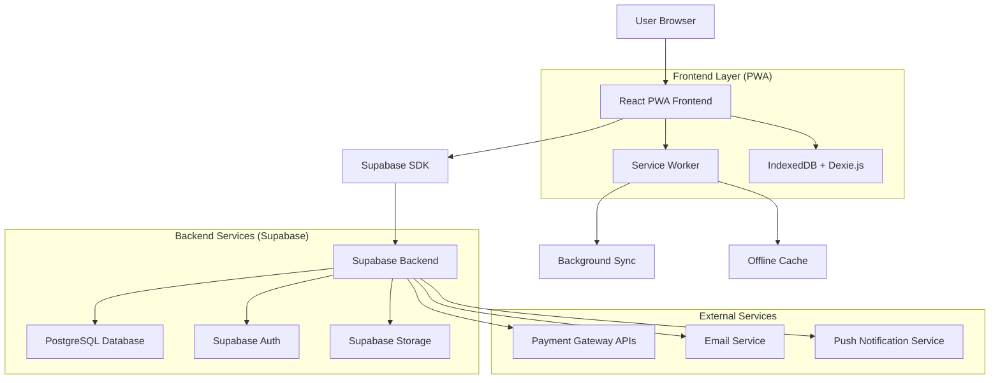
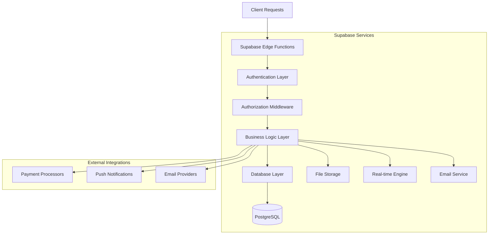
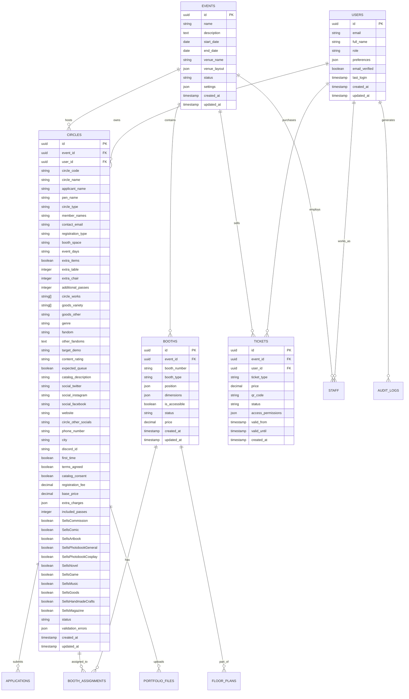

# DoujinDesk - Technical Architecture Document

## Table of Contents

1. [Architecture Design](#1-architecture-design)
2. [Technology Description](#2-technology-description)
3. [Route Definitions](#3-route-definitions)
4. [API Definitions](#4-api-definitions)
5. [Server Architecture Diagram](#5-server-architecture-diagram)
6. [Data Model](#6-data-model)
7. [Offline-First Architecture](#7-offline-first-architecture)
8. [Security Implementation](#8-security-implementation)
9. [Performance Optimization](#9-performance-optimization)
10. [Development Guidelines](#10-development-guidelines)
11. [Deployment Architecture](#11-deployment-architecture)
12. [Monitoring & Observability](#12-monitoring--observability)
13. [Troubleshooting Guide](#13-troubleshooting-guide)

***

## 1. Architecture Design

### 1.1 System Overview

DoujinDesk follows a modern PWA architecture with offline-first capabilities, leveraging Supabase as the backend-as-a-service platform for scalability and real-time features.

### 1.2 Architecture Diagram



## 2. Technology Description

* **Frontend**: React\@18 + TypeScript\@5 + Vite\@5 + PWA Plugin

* **UI Framework**: shadcn/ui + Tailwind CSS\@3 + Lucide React Icons

* **State Management**: Zustand\@4 with persistence middleware

* **Offline Storage**: IndexedDB with Dexie.js\@3 wrapper

* **PWA Features**: Workbox\@7 for service workers and caching strategies

* **Maps & Visualization**: Leaflet.js\@1.9 for interactive floor plans

* **Backend**: Supabase (PostgreSQL + Auth + Storage + Real-time)

* **Sync Strategy**: Custom offline-first sync with conflict resolution

* **Build Tools**: Vite with PWA plugin, TypeScript, ESLint, Prettier

## 3. Route Definitions

| Route          | Purpose                                                            |
| -------------- | ------------------------------------------------------------------ |
| /              | Dashboard - main overview with event statistics and quick actions  |
| /login         | Authentication page with role-based login                          |
| /circles       | Circle management - applications, directory, and approval workflow |
| /circles/apply | Public circle application portal                                   |
| /circles/:id   | Individual circle profile and management                           |
| /booths        | Booth allocation engine with interactive floor plan                |
| /booths/layout | Floor plan designer for booth arrangement                          |
| /tickets       | Ticketing system - tiers, pricing, and pass generation             |
| /access        | Access control - entry scanning and attendance tracking            |
| /finance       | Financial dashboard - payments, refunds, and reporting             |
| /staff         | Staff coordination - roles, tasks, and scheduling                  |
| /attendees     | Attendee management and communication                              |
| /guide         | Public event guide for attendees                                   |
| /reports       | Analytics and reporting dashboard                                  |
| /settings      | System configuration and user preferences                          |

## 4. API Definitions

### 4.1 Core API Endpoints

**Circle Management**

```
POST /api/circles/apply
```

Request:

| Parameter Name         | Type      | Required | Description                                             |
| ---------------------- | --------- | -------- | ------------------------------------------------------- |
| circle\_name           | string    | true     | Circle name (max 100 chars)                             |
| applicant\_name        | string    | true     | Applicant's real name (max 50 chars)                    |
| pen\_name              | string    | false    | Artist/creator pen name (max 50 chars)                  |
| circle\_type           | string    | true     | "individual" or "group"                                 |
| member\_names          | string    | false    | Comma-separated member names (required if group)        |
| contact\_email         | string    | true     | Primary contact email with validation                   |
| registration\_type     | string    | true     | "circle\_booth" or "circle\_space"                      |
| booth\_space           | string    | false    | "1\_space", "2\_space", "4\_space" (circle\_space only) |
| event\_days            | string    | false    | "saturday", "sunday", "both\_days" (circle\_space only) |
| extra\_items           | boolean   | false    | Request extra booth items (circle\_booth only)          |
| extra\_table           | integer   | false    | Additional tables (0-2, circle\_booth only)             |
| extra\_chair           | integer   | false    | Additional chairs (0-2, circle\_booth only)             |
| additional\_passes     | integer   | false    | Number of additional passes (0-5)                       |
| circle\_works          | string\[] | true     | Work types (auto-maps to catalog booleans)              |
| goods\_variety         | string\[] | false    | Specific goods types (if goods selected)                |
| goods\_other           | string    | false    | Custom goods description (if "other" selected)          |
| genre                  | string    | true     | "original", "fanart"                                    |
| fandom                 | string    | false    | Primary fandom (required if fanart)                     |
| other\_fandoms         | string    | false    | Additional fandoms (max 500 chars)                      |
| target\_demo           | string    | true     | "male\_oriented", "female\_oriented"                    |
| content\_rating        | string    | true     | "PG", "M", "GA"                                         |
| expected\_queue        | boolean   | false    | Expects long queues                                     |
| sample\_works          | File\[]   | true     | Sample work images (max 256KB each, JPG/PNG)            |
| circle\_cut            | File      | true     | Circle cut image (max 256KB, JPG/PNG, square)           |
| catalog\_description   | string    | false    | Catalog description (max 200 chars)                     |
| social\_twitter        | string    | false    | Twitter/X URL                                           |
| social\_instagram      | string    | false    | Instagram URL                                           |
| social\_facebook       | string    | false    | Facebook page URL                                       |
| website                | string    | false    | Personal/circle website URL                             |
| circle\_other\_socials | string    | false    | Other social media URL                                  |
| phone\_number          | string    | true     | Contact phone number                                    |
| city                   | string    | true     | Applicant's city                                        |
| discord\_id            | string    | false    | Discord username                                        |
| first\_time            | boolean   | true     | First time participating in this event                  |
| terms\_agreed          | boolean   | true     | Agreement to terms of service                           |
| catalog\_consent       | boolean   | true     | Catalog inclusion consent                               |

Response:

| Param Name         | Param Type | Description                                    |
| ------------------ | ---------- | ---------------------------------------------- |
| application\_id    | string     | Unique application identifier                  |
| status             | string     | Application status (pending/approved/rejected) |
| submission\_date   | string     | ISO timestamp                                  |
| registration\_fee  | number     | Total registration fee (IDR/USD)               |
| base\_price        | number     | Base registration price (IDR/USD)              |
| extra\_charges     | object     | Breakdown of additional charges                |
| included\_passes   | number     | Number of included exhibitor passes            |
| pricing\_breakdown | object     | Detailed cost calculation with currency        |
| currency           | string     | Payment currency (IDR/USD)                     |
| booth\_specs       | object     | Booth/space specifications and inclusions      |

**Booth Allocation**

```
PUT /api/booths/:booth_id/assign
```

Request:

| Param Name            | Param Type | isRequired | Description                    |
| --------------------- | ---------- | ---------- | ------------------------------ |
| circle\_id            | string     | true       | Circle to assign to booth      |
| booth\_type           | string     | true       | Type of booth assignment       |
| special\_requirements | string\[]  | false      | Accessibility or special needs |

**Ticketing System**

```
POST /api/tickets/generate
```

Request:

| Param Name       | Param Type | isRequired | Description                          |
| ---------------- | ---------- | ---------- | ------------------------------------ |
| attendee\_email  | string     | true       | Ticket holder email                  |
| ticket\_tier     | string     | true       | Ticket type (weekend/single-day/VIP) |
| payment\_method  | string     | true       | Payment processing method            |
| special\_pricing | boolean    | false      | PWD/children discount eligibility    |

Response:

| Param Name    | Param Type | Description              |
| ------------- | ---------- | ------------------------ |
| ticket\_id    | string     | Unique ticket identifier |
| qr\_code      | string     | Base64 encoded QR code   |
| access\_token | string     | Entry validation token   |

### 4.2 Real-time Subscriptions

**Live Event Updates**

```
SUBSCRIBE /realtime/event/:event_id
```

Channels:

* `attendance_updates` - Real-time entry/exit tracking

* `booth_status` - Circle check-in and booth activity

* `staff_communications` - Internal messaging and alerts

* `queue_management` - Live queue status updates

## 5. Server Architecture Diagram



### 4.4 Catalogue Data Export API

```
GET /api/catalogue/export
```

Response: Returns circle data in catalogue format with specific columns

| Param Name              | Param Type | Description                  |
| ----------------------- | ---------- | ---------------------------- |
| id                      | string     | Unique circle identifier     |
| user\_id                | string     | User account identifier      |
| circle\_code            | string     | Assigned circle code         |
| name                    | string     | Circle name                  |
| circle\_cut             | string     | Circle promotional image URL |
| circle\_type            | string     | Type of circle registration  |
| day                     | string     | Event day participation      |
| SellsCommission         | boolean    | Live commission services     |
| SellsComic              | boolean    | Comic book sales             |
| SellsArtbook            | boolean    | Artbook sales                |
| SellsPhotobookGeneral   | boolean    | General photobook sales      |
| SellsPhotobookCosplay   | boolean    | Cosplay photobook sales      |
| SellsNovel              | boolean    | Novel sales                  |
| SellsGame               | boolean    | Game sales                   |
| SellsMusic              | boolean    | Audio music sales            |
| SellsGoods              | boolean    | Goods/merchandise sales      |
| SellsHandmadeCrafts     | boolean    | Handmade crafts sales        |
| SellsMagazine           | boolean    | Magazine sales               |
| circle\_facebook        | string     | Facebook profile/page        |
| circle\_instagram       | string     | Instagram handle             |
| circle\_twitter         | string     | Twitter/X handle             |
| circle\_other\_socials  | string     | Other social media links     |
| marketplace\_link       | string     | Online marketplace link      |
| fandom                  | string     | Primary fandom               |
| other\_fandom           | string     | Additional fandoms           |
| rating                  | string     | Content rating (PG/M/GA)     |
| sampleworks\_images/0-9 | string     | Sample work image URLs       |

### 4.5 Post-Acceptance Circle Updates

```
PUT /api/circles/{id}/update-profile
```

Request: Allows accepted circles to update specific fields

| Parameter Name    | Type   | Required | Description                                   |
| ----------------- | ------ | -------- | --------------------------------------------- |
| sample\_works     | array  | false    | Updated sample work images                    |
| fandom            | string | false    | Updated fandom classification                 |
| social\_media     | object | false    | Updated social media links                    |
| marketplace\_link | string | false    | Updated marketplace link                      |
| circle\_works     | array  | false    | Updated product offerings (requires approval) |

Response:

| Parameter Name    | Type    | Description                     |
| ----------------- | ------- | ------------------------------- |
| status            | boolean | Update success status           |
| pending\_approval | array   | Fields requiring admin approval |
| updated\_fields   | array   | Successfully updated fields     |

## 6. Data Model

### 6.1 Data Model Definition



### 6.2 Data Definition Language

**Events Table**

```sql
-- Create events table
CREATE TABLE events (
    id UUID PRIMARY KEY DEFAULT gen_random_uuid(),
    name VARCHAR(255) NOT NULL,
    description TEXT,
    start_date DATE NOT NULL,
    end_date DATE NOT NULL,
    venue_name VARCHAR(255) NOT NULL,
    venue_layout JSONB DEFAULT '{}',
    status VARCHAR(50) DEFAULT 'planning' CHECK (status IN ('planning', 'registration_open', 'active', 'completed', 'cancelled')),
    settings JSONB DEFAULT '{}',
    created_at TIMESTAMP WITH TIME ZONE DEFAULT NOW(),
    updated_at TIMESTAMP WITH TIME ZONE DEFAULT NOW()
);

-- Create indexes
CREATE INDEX idx_events_status ON events(status);
CREATE INDEX idx_events_dates ON events(start_date, end_date);
```

**Circles Table**

```sql
-- Create circles table
CREATE TABLE circles (
    id UUID PRIMARY KEY DEFAULT gen_random_uuid(),
    event_id UUID REFERENCES events(id) ON DELETE CASCADE,
    user_id UUID REFERENCES auth.users(id) ON DELETE CASCADE,
    circle_code VARCHAR(10) UNIQUE,
    circle_name VARCHAR(100) NOT NULL,
    applicant_name VARCHAR(50) NOT NULL,
    pen_name VARCHAR(50),
    circle_type VARCHAR(20) NOT NULL CHECK (circle_type IN ('individual', 'group')),
    member_names VARCHAR(200),
    contact_email VARCHAR(255) NOT NULL,
    registration_type VARCHAR(20) CHECK (registration_type IN ('circle_booth', 'circle_space')),
    booth_space VARCHAR(30) CHECK (booth_space IN ('1_space', '2_space', '4_space')),
    event_days VARCHAR(20) CHECK (event_days IN ('saturday', 'sunday', 'both_days')),
    extra_items BOOLEAN DEFAULT false,
    extra_table INTEGER CHECK (extra_table IN (0, 1, 2)) DEFAULT 0,
    extra_chair INTEGER CHECK (extra_chair IN (0, 1, 2)) DEFAULT 0,
    additional_passes INTEGER DEFAULT 0 CHECK (additional_passes >= 0 AND additional_passes <= 5),
    circle_works TEXT[] CHECK (circle_works <@ ARRAY['Comic Book', 'Artbook', 'Magazine', 'Photobook (Cosplay)', 'Photobook (General)', 'Novel', 'Game (Digital)', 'Game (Analog)', 'Audio Music', 'Audio ASMR', 'Handmade Crafts', 'Live Commission', 'Goods/Merchandise']),
    goods_variety TEXT[],
    goods_other TEXT,
    genre VARCHAR(50) CHECK (genre IN ('Original', 'Fanart/Parody')),
    fandom VARCHAR(100),
    other_fandoms TEXT,
    target_demo VARCHAR(50) CHECK (target_demo IN ('Male Oriented', 'Female Oriented')),
    content_rating VARCHAR(10) CHECK (content_rating IN ('PG', 'M', 'GA')),
    expected_queue BOOLEAN DEFAULT FALSE,
    catalog_description VARCHAR(200),
    social_twitter VARCHAR(255),
    social_instagram VARCHAR(255),
    social_facebook VARCHAR(255),
    website VARCHAR(255),
    circle_other_socials VARCHAR(255),
    phone_number VARCHAR(20) NOT NULL,
    city VARCHAR(100) NOT NULL,
    discord_id VARCHAR(50),
    first_time BOOLEAN NOT NULL,
    terms_agreed BOOLEAN NOT NULL DEFAULT false,
    catalog_consent BOOLEAN NOT NULL DEFAULT false,
    registration_fee DECIMAL(10,2),
    base_price DECIMAL(10,2),
    currency VARCHAR(3) DEFAULT 'USD' CHECK (currency IN ('IDR', 'USD')),
    extra_charges JSONB,
    included_passes INTEGER DEFAULT 1,
    booth_specs JSONB DEFAULT '{}',
    SellsCommission BOOLEAN DEFAULT FALSE,
    SellsComic BOOLEAN DEFAULT FALSE,
    SellsArtbook BOOLEAN DEFAULT FALSE,
    SellsPhotobookGeneral BOOLEAN DEFAULT FALSE,
    SellsPhotobookCosplay BOOLEAN DEFAULT FALSE,
    SellsNovel BOOLEAN DEFAULT FALSE,
    SellsGame BOOLEAN DEFAULT FALSE,
    SellsMusic BOOLEAN DEFAULT FALSE,
    SellsGoods BOOLEAN DEFAULT FALSE,
    SellsHandmadeCrafts BOOLEAN DEFAULT FALSE,
    SellsMagazine BOOLEAN DEFAULT FALSE,
    status VARCHAR(50) DEFAULT 'pending' CHECK (status IN ('pending', 'approved', 'rejected', 'waitlist')),
    validation_errors JSONB DEFAULT '{}',
    created_at TIMESTAMP WITH TIME ZONE DEFAULT NOW(),
    updated_at TIMESTAMP WITH TIME ZONE DEFAULT NOW()
);

-- Create indexes
CREATE INDEX idx_circles_event_id ON circles(event_id);
CREATE INDEX idx_circles_user_id ON circles(user_id);
CREATE INDEX idx_circles_status ON circles(status);
CREATE INDEX idx_circles_circle_code ON circles(circle_code);
CREATE INDEX idx_circles_registration_type ON circles(registration_type);
```

**Booths Table**

```sql
-- Create booths table
CREATE TABLE booths (
    id UUID PRIMARY KEY DEFAULT gen_random_uuid(),
    event_id UUID REFERENCES events(id) ON DELETE CASCADE,
    booth_number VARCHAR(50) NOT NULL,
    booth_type VARCHAR(50) DEFAULT 'circle_space' CHECK (booth_type IN ('circle_space', 'booth_a', 'booth_b', 'corporate')),
    space_size VARCHAR(20) CHECK (space_size IN ('1_space', '2_space', '4_space', '2m_x_2m', '4m_x_2m')),
    position JSONB NOT NULL DEFAULT '{}',
    dimensions JSONB NOT NULL DEFAULT '{}',
    specifications JSONB DEFAULT '{}', -- tables, chairs, electricity specs
    is_accessible BOOLEAN DEFAULT false,
    status VARCHAR(50) DEFAULT 'available' CHECK (status IN ('available', 'assigned', 'occupied', 'maintenance')),
    price_idr DECIMAL(12,2) DEFAULT 0.00,
    price_usd DECIMAL(10,2) DEFAULT 0.00,
    created_at TIMESTAMP WITH TIME ZONE DEFAULT NOW(),
    updated_at TIMESTAMP WITH TIME ZONE DEFAULT NOW(),
    UNIQUE(event_id, booth_number)
);

-- Create indexes
CREATE INDEX idx_booths_event_id ON booths(event_id);
CREATE INDEX idx_booths_status ON booths(status);
CREATE INDEX idx_booths_type ON booths(booth_type);
CREATE INDEX idx_booths_space_size ON booths(space_size);

-- Insert initial booth pricing data
INSERT INTO booths (event_id, booth_number, booth_type, space_size, specifications, price_idr, price_usd) VALUES
-- Circle Spaces
('event_uuid', 'CS001', 'circle_space', '1_space', '{"table": "90cm x 45cm", "chairs": 2, "electricity": false}', 465000, 43),
('event_uuid', 'CS002', 'circle_space', '2_space', '{"table": "2x 90cm x 45cm", "chairs": 4, "electricity": false}', 930000, 86),
('event_uuid', 'CS003', 'circle_space', '4_space', '{"table": "4x 90cm x 45cm", "chairs": 8, "electricity": false}', 1860000, 172),
-- Circle Booths
('event_uuid', 'BA001', 'booth_a', '2m_x_2m', '{"table": "100x50x75cm", "chairs": 2, "electricity": "2 amp exclusive"}', 2325000, 200),
('event_uuid', 'BB001', 'booth_b', '4m_x_2m', '{"table": "2x 100x50x75cm", "chairs": 4, "electricity": "2 amp exclusive"}', 4650000, 400);

-- Additional pricing for extra items
-- Extra table: IDR 250K (USD 22)
-- Extra chair: IDR 100K (USD 8)
-- Additional passes: IDR 100K per day (USD 9), IDR 200K both days (USD 18)
```

**Booth Assignments Table**

```sql
-- Create booth assignments table
CREATE TABLE booth_assignments (
    id UUID PRIMARY KEY DEFAULT gen_random_uuid(),
    booth_id UUID REFERENCES booths(id) ON DELETE CASCADE,
    circle_id UUID REFERENCES circles(id) ON DELETE CASCADE,
    assigned_at TIMESTAMP WITH TIME ZONE DEFAULT NOW(),
    assigned_by UUID REFERENCES auth.users(id),
    special_requirements TEXT[],
    status VARCHAR(50) DEFAULT 'assigned' CHECK (status IN ('assigned', 'confirmed', 'cancelled')),
    UNIQUE(booth_id),
    UNIQUE(circle_id)
);

-- Create indexes
CREATE INDEX idx_booth_assignments_booth_id ON booth_assignments(booth_id);
CREATE INDEX idx_booth_assignments_circle_id ON booth_assignments(circle_id);
```

**Tickets Table**

```sql
-- Create tickets table
CREATE TABLE tickets (
    id UUID PRIMARY KEY DEFAULT gen_random_uuid(),
    event_id UUID REFERENCES events(id) ON DELETE CASCADE,
    user_id UUID REFERENCES auth.users(id) ON DELETE CASCADE,
    ticket_type VARCHAR(50) NOT NULL CHECK (ticket_type IN ('weekend', 'single_day', 'vip', 'staff', 'press')),
    price DECIMAL(10,2) NOT NULL DEFAULT 0.00,
    qr_code VARCHAR(255) UNIQUE NOT NULL,
    status VARCHAR(50) DEFAULT 'active' CHECK (status IN ('active', 'used', 'refunded', 'cancelled')),
    access_permissions JSONB DEFAULT '{}',
    valid_from TIMESTAMP WITH TIME ZONE NOT NULL,
    valid_until TIMESTAMP WITH TIME ZONE NOT NULL,
    created_at TIMESTAMP WITH TIME ZONE DEFAULT NOW()
);

-- Create indexes
CREATE INDEX idx_tickets_event_id ON tickets(event_id);
CREATE INDEX idx_tickets_user_id ON tickets(user_id);
CREATE INDEX idx_tickets_qr_code ON tickets(qr_code);
CREATE INDEX idx_tickets_status ON tickets(status);
```

**Row Level Security Policies**

```sql
-- Enable RLS on all tables
ALTER TABLE events ENABLE ROW LEVEL SECURITY;
ALTER TABLE circles ENABLE ROW LEVEL SECURITY;
ALTER TABLE booths ENABLE ROW LEVEL SECURITY;
ALTER TABLE booth_assignments ENABLE ROW LEVEL SECURITY;
ALTER TABLE tickets ENABLE ROW LEVEL SECURITY;

-- Basic access policies
GRANT SELECT ON events TO anon;
GRANT ALL PRIVILEGES ON events TO authenticated;

GRANT SELECT ON circles TO anon;
GRANT ALL PRIVILEGES ON circles TO authenticated;

GRANT SELECT ON booths TO anon;
GRANT ALL PRIVILEGES ON booths TO authenticated;

GRANT ALL PRIVILEGES ON booth_assignments TO authenticated;
GRANT ALL PRIVILEGES ON tickets TO authenticated;
```

## 8. Security Implementation

### 8.1 Authentication & Authorization

**Supabase Auth Integration:**

```typescript
// Authentication service implementation
import { createClient } from '@supabase/supabase-js'

const supabase = createClient(
  process.env.REACT_APP_SUPABASE_URL!,
  process.env.REACT_APP_SUPABASE_ANON_KEY!
)

// Role-based access control
export const checkPermission = async (userId: string, resource: string, action: string) => {
  const { data: userRole } = await supabase
    .from('user_roles')
    .select('role, permissions')
    .eq('user_id', userId)
    .single()
  
  return userRole?.permissions?.[resource]?.includes(action) || false
}
```

**Row Level Security (RLS) Policies:**

```sql
-- Circle data access policy
CREATE POLICY "Users can view own circle data" ON circles
  FOR SELECT USING (auth.uid() = user_id OR 
    EXISTS (SELECT 1 FROM user_roles WHERE user_id = auth.uid() AND role IN ('admin', 'staff')));

-- Event staff access policy
CREATE POLICY "Staff can manage event data" ON events
  FOR ALL USING (
    EXISTS (SELECT 1 FROM user_roles 
            WHERE user_id = auth.uid() 
            AND role IN ('admin', 'staff')
            AND event_id = events.id)
  );
```

### 8.2 Data Protection

**Encryption Standards:**

* TLS 1.3 for data in transit

* AES-256 encryption for sensitive data at rest

* bcrypt for password hashing (cost factor: 12)

* JWT tokens with 24-hour expiration

**Data Sanitization:**

```typescript
// Input validation and sanitization
import DOMPurify from 'dompurify'
import { z } from 'zod'

const circleApplicationSchema = z.object({
  circle_name: z.string().min(1).max(100).regex(/^[\w\s-]+$/),
  contact_email: z.string().email(),
  booth_type: z.enum(['circle_space_1', 'circle_space_2', 'circle_space_4', 'booth_a', 'booth_b']),
  // ... other fields
})

export const sanitizeInput = (input: string): string => {
  return DOMPurify.sanitize(input.trim())
}
```

### 8.3 API Security

**Rate Limiting:**

```typescript
// API rate limiting configuration
const rateLimitConfig = {
  windowMs: 15 * 60 * 1000, // 15 minutes
  max: 100, // limit each IP to 100 requests per windowMs
  message: 'Too many requests from this IP',
  standardHeaders: true,
  legacyHeaders: false,
}
```

**CORS Configuration:**

```typescript
const corsOptions = {
  origin: process.env.NODE_ENV === 'production' 
    ? ['https://doujindesk.com', 'https://app.doujindesk.com']
    : ['http://localhost:3000', 'http://localhost:5173'],
  credentials: true,
  optionsSuccessStatus: 200
}
```

## 9. Performance Optimization

### 9.1 Frontend Performance

**Code Splitting & Lazy Loading:**

```typescript
// Route-based code splitting
import { lazy, Suspense } from 'react'

const CircleManagement = lazy(() => import('./pages/CircleManagement'))
const BoothAllocation = lazy(() => import('./pages/BoothAllocation'))
const EventDashboard = lazy(() => import('./pages/EventDashboard'))

// Component lazy loading with loading states
const LazyRoute = ({ component: Component, ...props }) => (
  <Suspense fallback={<LoadingSpinner />}>
    <Component {...props} />
  </Suspense>
)
```

**Virtual Scrolling Implementation:**

```typescript
// Virtual scrolling for large datasets
import { FixedSizeList as List } from 'react-window'

const CircleList = ({ circles }: { circles: Circle[] }) => {
  const Row = ({ index, style }) => (
    <div style={style}>
      <CircleCard circle={circles[index]} />
    </div>
  )

  return (
    <List
      height={600}
      itemCount={circles.length}
      itemSize={120}
      width="100%"
    >
      {Row}
    </List>
  )
}
```

### 9.2 Database Performance

**Optimized Queries:**

```sql
-- Efficient circle search with proper indexing
CREATE INDEX CONCURRENTLY idx_circles_search 
ON circles USING gin(to_tsvector('english', circle_name || ' ' || fandom));

-- Booth allocation optimization
CREATE INDEX idx_booth_assignments_event_status 
ON booth_assignments(event_id, status) 
WHERE status IN ('allocated', 'confirmed');

-- Performance monitoring query
SELECT 
  schemaname,
  tablename,
  attname,
  n_distinct,
  correlation
FROM pg_stats 
WHERE tablename IN ('circles', 'booth_assignments', 'events')
ORDER BY tablename, attname;
```

**Connection Pooling:**

```typescript
// Supabase connection optimization
const supabaseConfig = {
  auth: {
    persistSession: true,
    autoRefreshToken: true,
  },
  db: {
    schema: 'public',
  },
  global: {
    headers: {
      'x-application-name': 'doujindesk-pwa',
    },
  },
}
```

### 9.3 Caching Strategy

**Multi-Level Caching:**

```typescript
// Service Worker caching strategy
const cacheStrategy = {
  // Static assets - Cache First
  static: new CacheFirst({
    cacheName: 'static-assets-v1',
    plugins: [
      new ExpirationPlugin({
        maxEntries: 100,
        maxAgeSeconds: 30 * 24 * 60 * 60, // 30 days
      }),
    ],
  }),
  
  // API responses - Network First with fallback
  api: new NetworkFirst({
    cacheName: 'api-cache-v1',
    networkTimeoutSeconds: 3,
    plugins: [
      new ExpirationPlugin({
        maxEntries: 50,
        maxAgeSeconds: 5 * 60, // 5 minutes
      }),
    ],
  }),
  
  // Images - Stale While Revalidate
  images: new StaleWhileRevalidate({
    cacheName: 'images-cache-v1',
    plugins: [
      new ExpirationPlugin({
        maxEntries: 200,
        maxAgeSeconds: 7 * 24 * 60 * 60, // 7 days
      }),
    ],
  }),
}
```

## 10. Development Guidelines

### 10.1 Code Standards

**TypeScript Configuration:**

```json
// tsconfig.json
{
  "compilerOptions": {
    "target": "ES2020",
    "lib": ["DOM", "DOM.Iterable", "ES6"],
    "allowJs": true,
    "skipLibCheck": true,
    "esModuleInterop": true,
    "allowSyntheticDefaultImports": true,
    "strict": true,
    "forceConsistentCasingInFileNames": true,
    "noFallthroughCasesInSwitch": true,
    "module": "esnext",
    "moduleResolution": "node",
    "resolveJsonModule": true,
    "isolatedModules": true,
    "noEmit": true,
    "jsx": "react-jsx"
  },
  "include": ["src"],
  "exclude": ["node_modules"]
}
```

**ESLint Configuration:**

```json
// .eslintrc.json
{
  "extends": [
    "@typescript-eslint/recommended",
    "react-hooks/recommended",
    "prettier"
  ],
  "rules": {
    "@typescript-eslint/no-unused-vars": "error",
    "@typescript-eslint/explicit-function-return-type": "warn",
    "react-hooks/exhaustive-deps": "error",
    "no-console": "warn"
  }
}
```

### 10.2 Project Structure

```
src/
├── components/           # Reusable UI components
│   ├── ui/              # Base UI components (shadcn/ui)
│   ├── forms/           # Form components
│   └── layout/          # Layout components
├── pages/               # Route components
│   ├── admin/           # Admin-specific pages
│   ├── circle/          # Circle management pages
│   └── event/           # Event-specific pages
├── hooks/               # Custom React hooks
├── services/            # API and external service integrations
├── stores/              # Zustand stores
├── types/               # TypeScript type definitions
├── utils/               # Utility functions
├── constants/           # Application constants
└── assets/              # Static assets
```

### 10.3 Component Guidelines

**Component Template:**

```typescript
// components/CircleCard.tsx
import React from 'react'
import { Circle } from '@/types/circle'
import { Card, CardContent, CardHeader, CardTitle } from '@/components/ui/card'

interface CircleCardProps {
  circle: Circle
  onEdit?: (circle: Circle) => void
  className?: string
}

export const CircleCard: React.FC<CircleCardProps> = ({ 
  circle, 
  onEdit, 
  className 
}) => {
  return (
    <Card className={className}>
      <CardHeader>
        <CardTitle>{circle.circle_name}</CardTitle>
      </CardHeader>
      <CardContent>
        {/* Component content */}
      </CardContent>
    </Card>
  )
}

CircleCard.displayName = 'CircleCard'
```

## 11. Deployment Architecture

### 11.1 Environment Configuration

**Production Environment:**

```yaml
# docker-compose.prod.yml
version: '3.8'
services:
  doujindesk-app:
    image: doujindesk:latest
    ports:
      - "80:80"
      - "443:443"
    environment:
      - NODE_ENV=production
      - REACT_APP_SUPABASE_URL=${SUPABASE_URL}
      - REACT_APP_SUPABASE_ANON_KEY=${SUPABASE_ANON_KEY}
    volumes:
      - ./nginx.conf:/etc/nginx/nginx.conf
      - ./ssl:/etc/ssl/certs
    restart: unless-stopped
```

**CI/CD Pipeline:**

```yaml
# .github/workflows/deploy.yml
name: Deploy to Production
on:
  push:
    branches: [main]

jobs:
  deploy:
    runs-on: ubuntu-latest
    steps:
      - uses: actions/checkout@v3
      
      - name: Setup Node.js
        uses: actions/setup-node@v3
        with:
          node-version: '18'
          cache: 'npm'
      
      - name: Install dependencies
        run: npm ci
      
      - name: Run tests
        run: npm run test:ci
      
      - name: Build application
        run: npm run build
        env:
          REACT_APP_SUPABASE_URL: ${{ secrets.SUPABASE_URL }}
          REACT_APP_SUPABASE_ANON_KEY: ${{ secrets.SUPABASE_ANON_KEY }}
      
      - name: Deploy to production
        run: npm run deploy
        env:
          DEPLOY_TOKEN: ${{ secrets.DEPLOY_TOKEN }}
```

### 11.2 Infrastructure Requirements

**Minimum System Requirements:**

* **CPU:** 2 vCPUs

* **RAM:** 4GB

* **Storage:** 20GB SSD

* **Bandwidth:** 100 Mbps

* **CDN:** CloudFlare or AWS CloudFront

**Recommended Production Setup:**

* **CPU:** 4 vCPUs

* **RAM:** 8GB

* **Storage:** 50GB SSD

* **Load Balancer:** NGINX or AWS ALB

* **Database:** Supabase Pro plan

* **Monitoring:** DataDog or New Relic

## 12. Monitoring & Observability

### 12.1 Application Monitoring

**Performance Metrics:**

```typescript
// utils/monitoring.ts
import { getCLS, getFID, getFCP, getLCP, getTTFB } from 'web-vitals'

export const initializeMonitoring = () => {
  // Core Web Vitals
  getCLS(console.log)
  getFID(console.log)
  getFCP(console.log)
  getLCP(console.log)
  getTTFB(console.log)
  
  // Custom metrics
  performance.mark('app-start')
  
  // Error tracking
  window.addEventListener('error', (event) => {
    console.error('Global error:', event.error)
    // Send to monitoring service
  })
  
  window.addEventListener('unhandledrejection', (event) => {
    console.error('Unhandled promise rejection:', event.reason)
    // Send to monitoring service
  })
}
```

**Health Check Endpoints:**

```typescript
// Health check implementation
export const healthCheck = {
  '/health': {
    status: 'healthy',
    timestamp: new Date().toISOString(),
    version: process.env.REACT_APP_VERSION,
    uptime: process.uptime()
  },
  
  '/health/detailed': {
    database: await checkDatabaseConnection(),
    storage: await checkStorageConnection(),
    cache: await checkCacheStatus(),
    serviceWorker: await checkServiceWorkerStatus()
  }
}
```

### 12.2 Logging Strategy

**Structured Logging:**

```typescript
// utils/logger.ts
interface LogEntry {
  level: 'info' | 'warn' | 'error' | 'debug'
  message: string
  timestamp: string
  userId?: string
  eventId?: string
  metadata?: Record<string, any>
}

export const logger = {
  info: (message: string, metadata?: Record<string, any>) => {
    const entry: LogEntry = {
      level: 'info',
      message,
      timestamp: new Date().toISOString(),
      metadata
    }
    console.log(JSON.stringify(entry))
  },
  
  error: (message: string, error?: Error, metadata?: Record<string, any>) => {
    const entry: LogEntry = {
      level: 'error',
      message,
      timestamp: new Date().toISOString(),
      metadata: { ...metadata, stack: error?.stack }
    }
    console.error(JSON.stringify(entry))
  }
}
```

## 13. Troubleshooting Guide

### 13.1 Common Development Issues

**Build Failures:**

```bash
# Clear cache and reinstall dependencies
npm run clean
rm -rf node_modules package-lock.json
npm install

# TypeScript compilation errors
npx tsc --noEmit --skipLibCheck

# Service Worker registration issues
# Check browser dev tools -> Application -> Service Workers
# Ensure HTTPS in production
```

**Database Connection Issues:**

```typescript
// Debug Supabase connection
const testConnection = async () => {
  try {
    const { data, error } = await supabase
      .from('events')
      .select('count')
      .limit(1)
    
    if (error) {
      console.error('Database connection failed:', error)
      return false
    }
    
    console.log('Database connection successful')
    return true
  } catch (err) {
    console.error('Connection test failed:', err)
    return false
  }
}
```

### 13.2 Performance Debugging

**Bundle Analysis:**

```bash
# Analyze bundle size
npm run build
npx webpack-bundle-analyzer build/static/js/*.js

# Check for memory leaks
# Use Chrome DevTools -> Memory tab
# Take heap snapshots before/after operations
```

**Database Query Optimization:**

```sql
-- Enable query logging in Supabase
SET log_statement = 'all';
SET log_min_duration_statement = 100;

-- Analyze slow queries
SELECT query, mean_time, calls, total_time
FROM pg_stat_statements
ORDER BY mean_time DESC
LIMIT 10;
```

### 13.3 Production Issues

**Emergency Response Checklist:**

1. **Identify Impact Scope**

   * Check monitoring dashboards

   * Review error logs

   * Assess user reports

2. **Immediate Actions**

   * Enable maintenance mode if necessary

   * Scale resources if performance issue

   * Rollback if recent deployment

3. **Communication**

   * Update status page

   * Notify stakeholders

   * Document timeline

4. **Resolution**

   * Apply hotfix or rollback

   * Verify fix in staging

   * Monitor post-deployment

5. **Post-Incident**

   * Conduct post-mortem

   * Update runbooks

   * Implement preventive measures

***

*This document is maintained by the DoujinDesk development team. Last updated: \[Date]. For technical support, contact:* *<dev-team@doujindesk.com>*

## 7. Offline-First Architecture

### 7.1 Service Worker Strategy

* **Cache First**: Static assets (HTML, CSS, JS, images)

* **Network First**: Dynamic API calls with offline fallback

* **Stale While Revalidate**: Event data and circle information

* **Background Sync**: Queue operations when offline

### 7.2 Data Synchronization

* **Conflict Resolution**: Last-write-wins with user notification

* **Optimistic Updates**: Immediate UI feedback with rollback capability

* **Batch Operations**: Group multiple changes for efficient sync

* **Delta Sync**: Only transfer changed data to minimize bandwidth

### 7.3 Storage Management

* **IndexedDB**: Primary offline storage (50MB+ capacity)

* **Cache API**: Static asset caching

* **Local Storage**: User preferences and session data

* **Compression**: GZIP compression for large datasets

